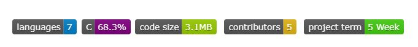
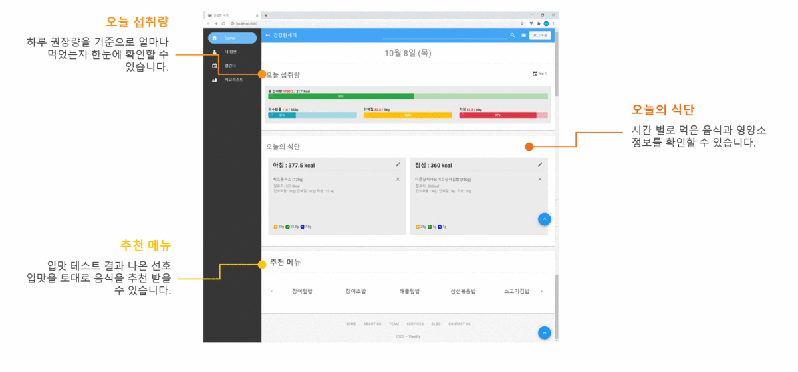

## Description

`건강한 세끼(Healthy meals)`는 하루 권장 섭취량을 고려한 맞춤형 식단 관리 서비스입니다.

- __식단 관리 기능__

  먹은 음식을 기록하고 개인만의 식단 캘린더로 섭취 정보를 모아볼 수 있습니다. 

  프랜차이즈 메뉴, 가공 식품 등 세부적인 영양소 데이터를 제공하여 더 정확한 섭취 영양소를 계산해줍니다. 

  사용자의 체중, 나이, 성별에 맞춰 하루 권장 섭취량을 계산하여 오늘 권장 섭취량을 얼마나 먹었는지 확인할 수 있습니다. 

- __메뉴 추천 기능__ 

  가입 후 간단한 음식 선호도 검사를 하여 정해진 선호 입맛과 권장 섭취량을 기준으로 메뉴를 추천해줍니다. 

  식단을 입력할 때 음식에 대한 평점을 선호 입맛에 반영합니다.

  검색한 메뉴와 유사한 메뉴를 추천해줍니다. 

- __다양한 메뉴 관련 정보__ 

  상세 영양소 정보 뿐만 아니라 현재 위치에서 해당 음식을 파는 음식점을 지도에 표시해줍니다.

  직접 요리해먹을 경우 레시피 탭을 통해 해당 음식의 조리법을 영상으로 볼 수 있습니다.
  
  

## Development Environment

-   
-  
-  
-  
-  
-  
-  
-   
-  
-  
-  


## Installation

#### For developer

로컬에서 코드를 원활하게 실행하기위해 두 개의 터미널을 사용해야합니다.

__백엔드 서버__

`./sub2/backend/` 디렉토리에서 진행해주세요.

1. 가상환경 구축 및 가상환경 실행

   ```bash
   $ python -m venv venv
   
   # window
   $ source venv/Scripts/activate
   # mac
   $ source venv/bin/activate
   ```

2. 구동에 필요한 패키지 설치

   ```bash
   $ pip install -r requirements.txt
   ```

3. DB 마이그레이션

   ```bash
   $ python manage.py migrate
   ```

4. 서버 실행

   ```bash
   $ python manage.py runserver
   ```

__프론트 서버__

`./sub2/frontend/` 디렉토리에서 진행해주세요.

1. 구동에 필요한 패키지 설치

   ```bash
   $ npm i
   ```

2. 서버 실행

   ```bash
   $ npm run serve
   ```

   

#### For user


한 번쯤 이런 고민을 해봤다면 :question: 

나를 위한 메뉴 추천, __Healthy Meals__ :heavy_exclamation_mark:

~~아래의 버튼을 통해 서비스를 이용할 수 있습니다.~~

[](https://j3d201.p.ssafy.io/)


## Dependency

- 모든 코드는 Python 3과 JavaScript, Django Template으로 작성되었습니다.
- 해당 프로젝트는 Vue, Django Framework를 사용하여 구성되었습니다.


## APIs

### 식품영양성분 DB (2020.09.03)

- 식품별 영양소 정보를 얻기 위해서 사용합니다.
- [식품영양성분DB](https://www.foodsafetykorea.go.kr/fcdb/) 회원가입 후 OPEN API 신청 또는 다운로드 받기를 통해 이용할 수 있습니다.


## Browser Support

|  |  |  |  |  |  |  |  |  |  |
| :----------------------------------: | :--------------------------: | :------------------------------------: | :------------------------------: | :-------------------------------: | :--------------------------------: | :-----------------------------------: | :-------------------------------: | :----------------------------------------------------------: | :----------------------------------: |
|                  ✔                   |              ❌               |                   ✔                    |                ✔                 |                 ✔                 |                 ✔                  |                   ✔                   |                 ✔                 |                              ✔                               |                  ❌                   |


## Demo




## Contributors

[](https://lab.ssafy.com/kei9641) | [](https://lab.ssafy.com/park940313)| [](https://lab.ssafy.com/bjh7013)| [](https://lab.ssafy.com/dngustls)| [](https://github.com/leeyongsu)


## Appenndix

| 파일 이름                                                    | 기술                                               |
| ------------------------------------------------------------ | -------------------------------------------------- |
| [README](https://github.com/kei9641/healthy-meals/blob/master/README.md) | 프로젝트의 설명을 위한 텍스트 파일 (md 형식)       |
| [sequence](https://github.com/kei9641/healthy-meals/blob/master/appendix/sequence.md) | 객체 간의 상호작용을 나타내는 다이어그램 (md 형식) |
| [erd](https://github.com/kei9641/healthy-meals/blob/master/appendix/erd.png) | 프로젝트의 모델링을 위한 erd (png 형식)            |
| [intro](https://github.com/kei9641/healthy-meals/blob/master/appendix/intro.mp4) | 프로젝트 소개 영상 (mp4 형식)                      |


#### How to contact me

- 추가적으로 궁금한 사항이나 연락을 원하시면 kei9641@naver.com으로 메일을 보내주세요. 읽는 즉시 답장드리겠습니다.
- 더 빠른 연락이 필요하시면 [오픈카톡](https://open.kakao.com/me/here0k)으로 연락주세요.

자세한 사항은 [프로필](#)을 확인해주세요.


© 2021. 김영주 all rights reserved.
