## 1. 회원 가입

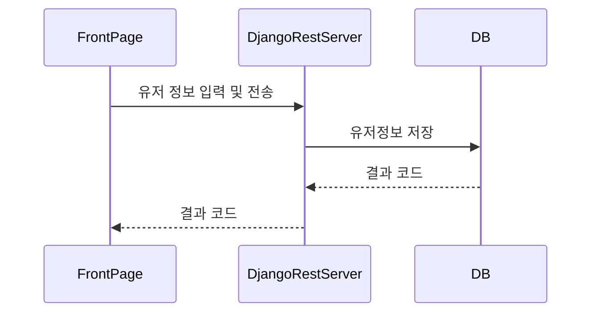

## 2. 로그인

사용자로부터 입력된 ID, PW를 DB에 저장된 사용자 레코드와 비교한 후 로그인 진행

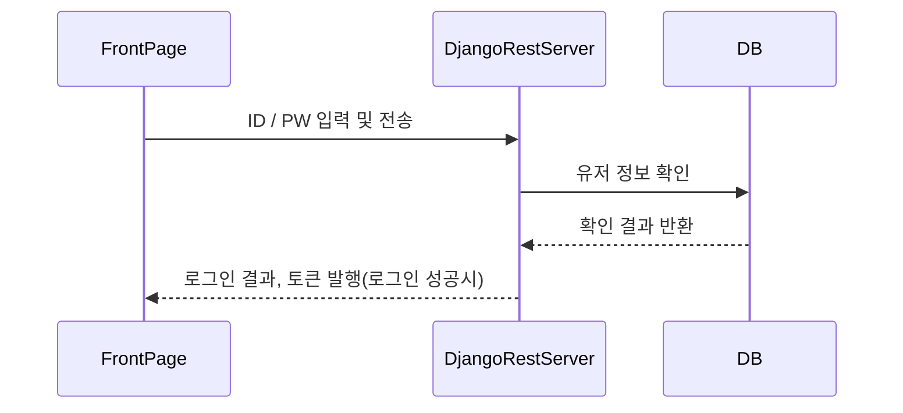

## 3. 마이페이지

유저정보 조회는, 클라이언트에서 서버로 토큰 전송 후, 서버에서 토큰 유효성 검사 및 토큰에서 유저번호를 추출하여 DB에서 적절한 결과를 조회한다.

#### 유효한 요청

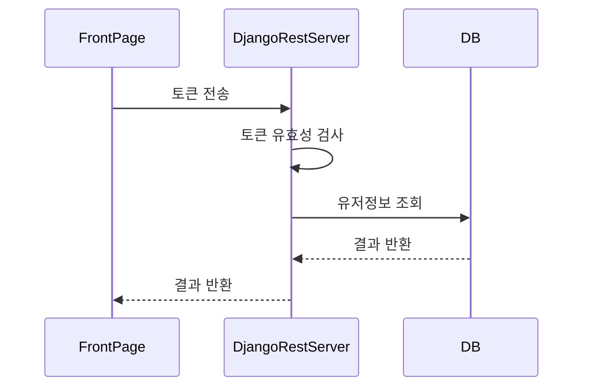

#### 유효하지 않은 요청

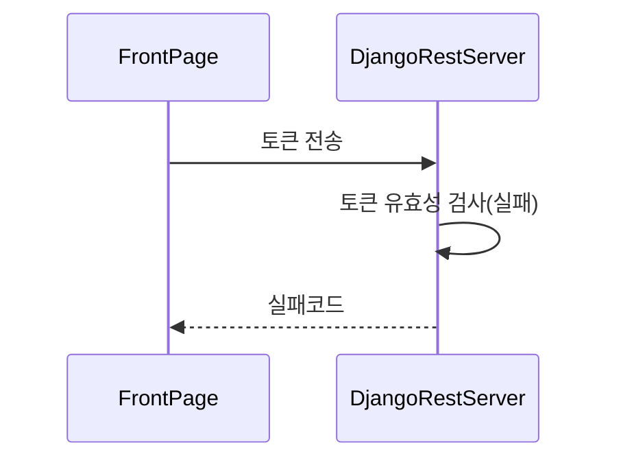

## 4. 개인 정보 수정

#### 유효한 요청

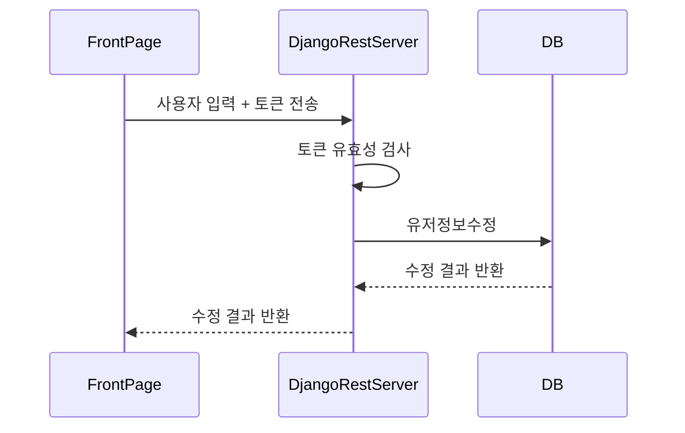

#### 유효하지 않은 요청

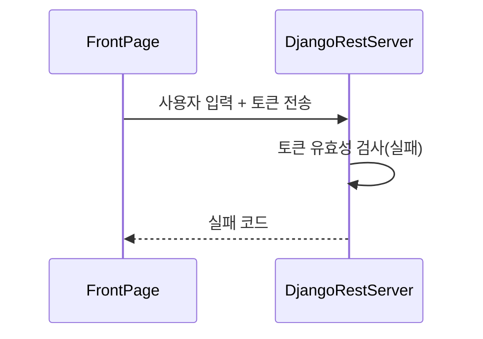

## 5. 음식 검색

검색어와 음식명, 제조사, 맛표현, 영양성분 등의 조건을 이용해 검색

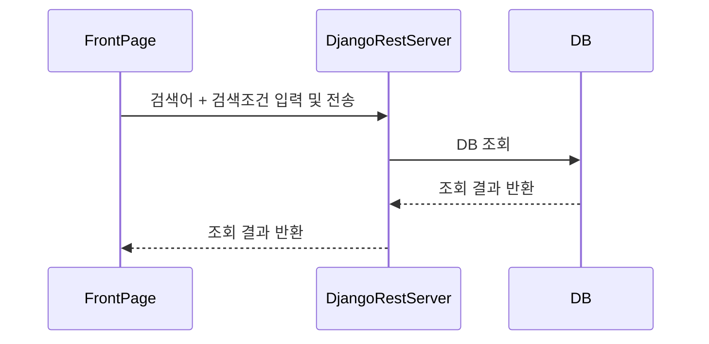

## 6. 음식 비교리스트 : 추가

토큰 + 음식정보를 이용해 사용자의 비교리스트에 해당 음식 추가

#### 유효한 요청

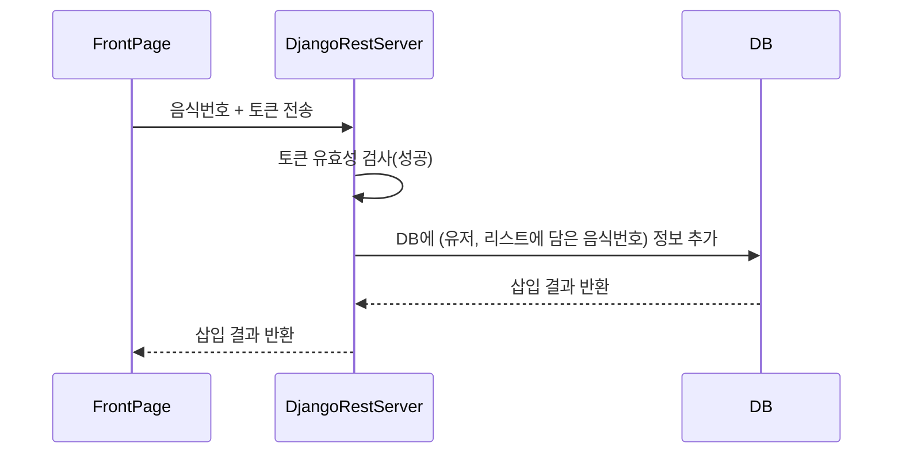

#### 유효하지 않은 요청

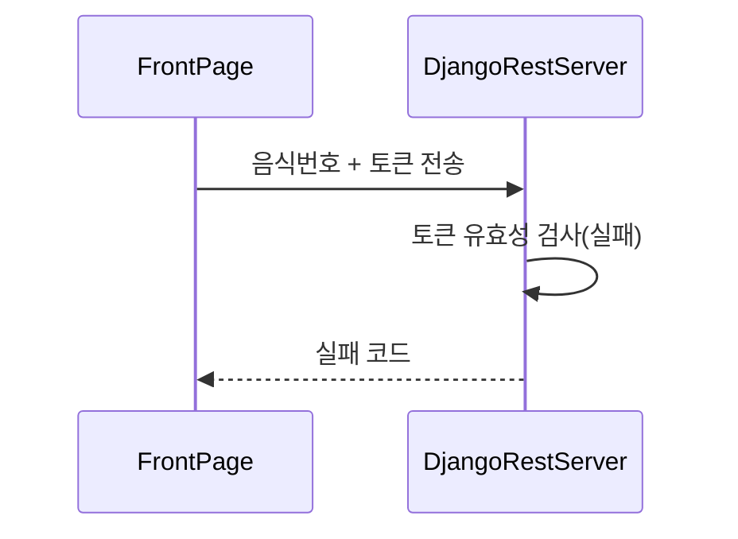

## 7. 음식 비교리스트 : 조회

서버로부터 

1. 사용자가 비교리스트에 넣은 음식정보
2. 권장섭취량 - 현재섭취량 정보

획득 후 음식간 영양성분 비교

#### 유효한 요청

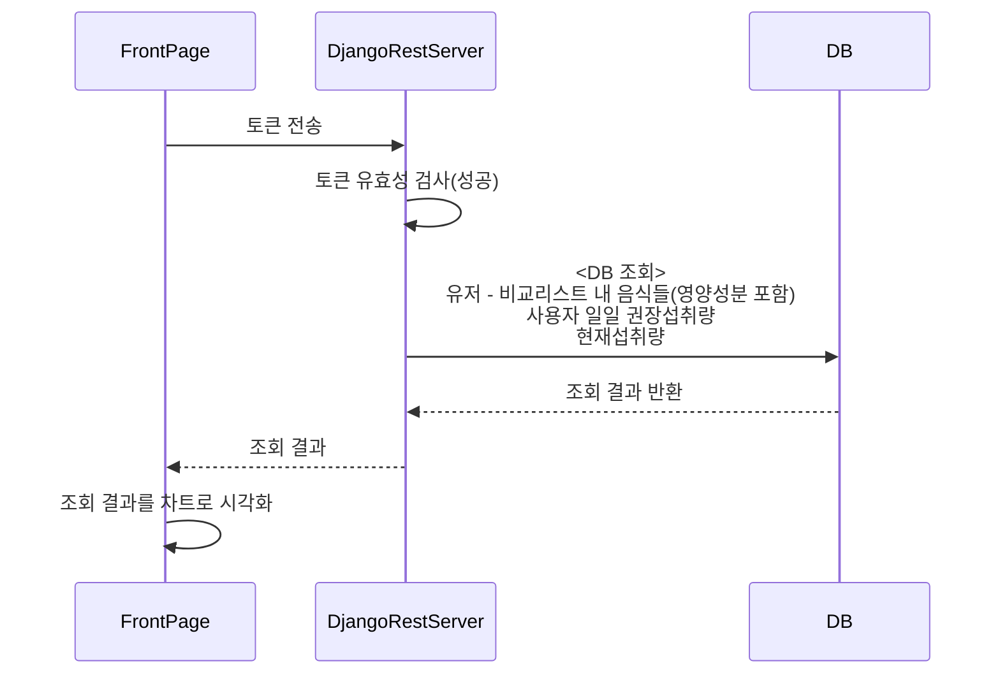

#### 유효하지 않은 요청

## 8. 음식 비교리스트 : 삭제

#### 유효한 요청

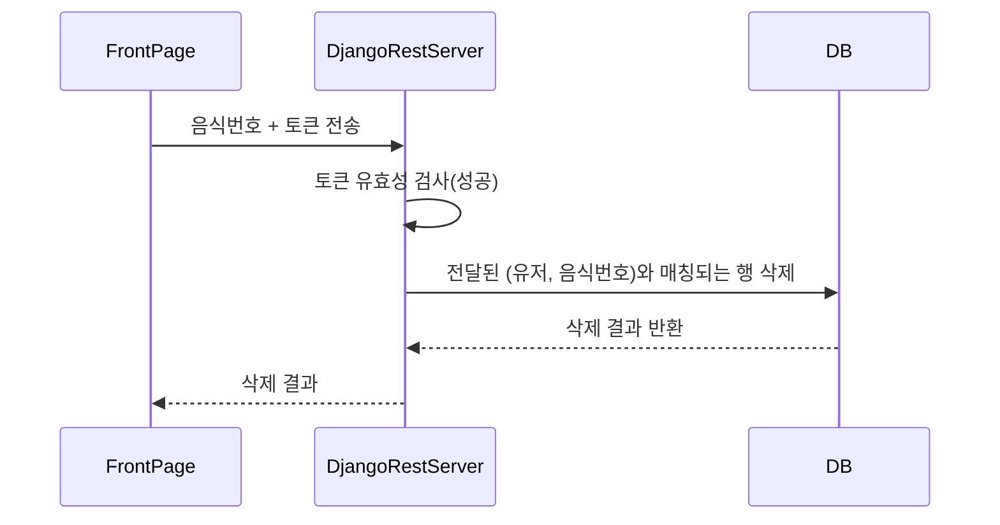

#### 유효하지 않은 요청

## 9. 음식 상세 정보

### 	9 - 1. 영양정보

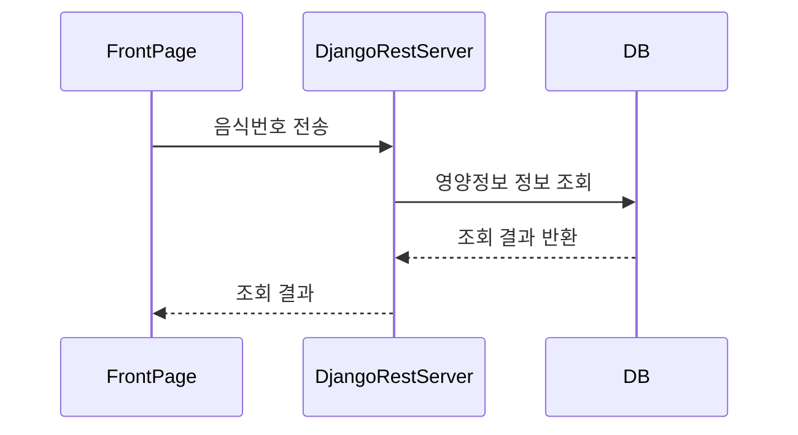

###  9 - 2. 레시피 탭

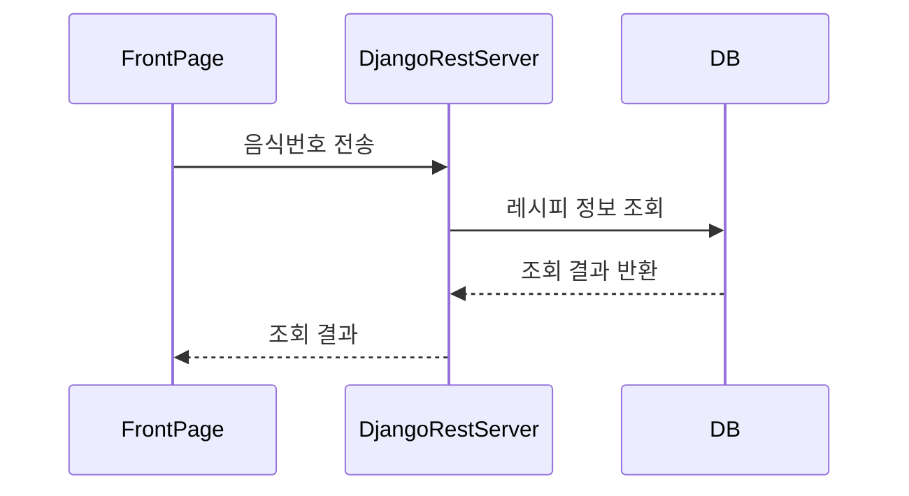

​	

### 	9 - 3. 주변 음식점

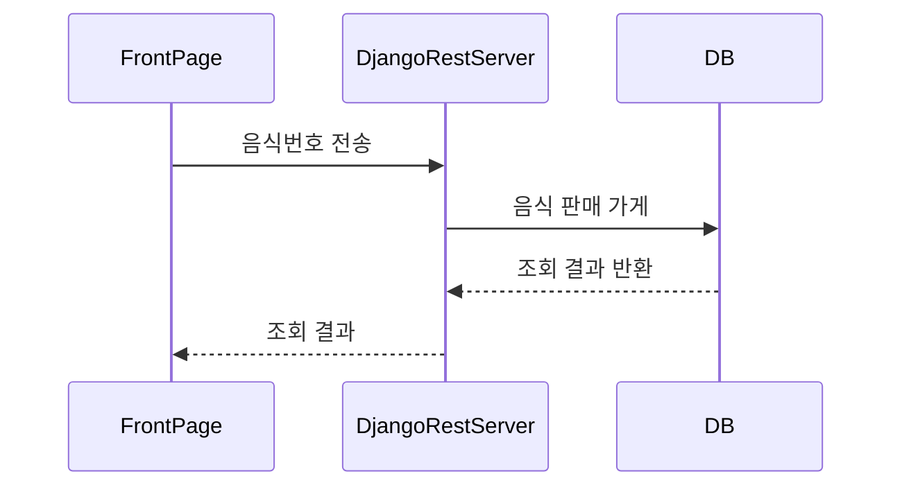

## 10. 식단 캘린더

#### 유효한 요청

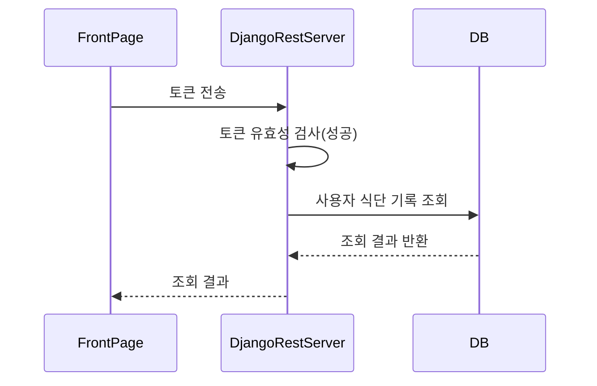

#### 유효하지 않은 요청

