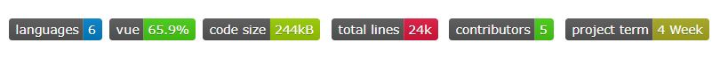

## Description

`Mygumi`는 미션을 해결하며 구미시를 200% 즐기는 게임형 앱입니다.

- __편리한 여행 계획__

  검색 기능으로 여행지에 대한 정보를 찾아보고 일정에 추가할 수 있습니다.

  여행지별 추천 코스나 추천 여행지 제공하여 간단하게 여행 일정을 계획할 수 있습니다.

  일정에 함께 갈 친구를 추가하면 여행 일정을 공유할 수 있습니다.

- __기억에 남는 즐거운 여행__ 

  여행지 마다 주어지는 미션 수행하며 잊지 못할 추억을 남기고, 숨겨진 업적을 찾아보세요!

  랜덤 미션 기능을 통해 일정없이 바로 여행을 즐길 수도 있습니다.

- __소중한 추억 관리__ 

  지도에 깃발로 표시하여 미션을 완료한 여행지를 한 눈에 볼 수 있습니다.

  여행지 리뷰를 남겨 여행을 느꼈던 점을 공유해보세요.

  마이페이지에서 앨범형식으로 모아서 볼 수 있습니다.


## Development Environment

-  

-  

-  

-  

-  

-  

-  

-   

-  

-  

-  

-  

-  

  

## Installation

#### For developer

로컬에서 코드를 원활하게 실행하기위해 두 개의 터미널을 사용해야합니다.

__백엔드 서버__

`./backend/gumi/` 디렉토리에서 진행해주세요.

1. 가상환경 구축 및 가상환경 실행

   ```bash
   $ python -m venv venv
   
   # window
   $ source venv/Scripts/activate
   # mac
   $ source venv/bin/activate
   ```

2. 구동에 필요한 패키지 설치

   ```bash
   $ pip install -r requirements.txt
   ```

3. DB 마이그레이션

   ```bash
   $ python manage.py migrate
   ```

5. 서버 실행

   ```bash
   $ python manage.py runserver
   ```

__프론트 서버__

`./frontend/` 디렉토리에서 진행해주세요.

1. 구동에 필요한 패키지 설치

   ```bash
   $ npm i
   ```

2. 서버 실행

   ```bash
   $ npm run serve
   ```

   

#### For user

~~아래의 버튼을 통해 서비스를 이용할 수 있습니다.~~

[](https://k3d201.p.ssafy.io/)


## Dependency

- 모든 코드는 Python 3과 JavaScript, Django Template으로 작성되었습니다.
- 해당 프로젝트는 Vue, Django Framework를 사용하여 구성되었습니다.


## Browser Support

|  |  |  |  |  |  |  |
| :----------------------------------: | :--------------------------: | :------------------------------------: | :------------------------------: | :-------------------------------: | :----------------------------------------------------------: | :----------------------------------: |
|                  ✔                   |              ❌               |                   ✔                    |                ✔                 |                 ✔                 |                              ✔                               |                  ❌                   |


## Demo


## Contributors

[](https://github.com/kei9641)| [](https://github.com/wjddn279)| [](https://github.com/lunarus00)| [](https://github.com/ansigyeong)| [](https://github.com/HwnagYoungJun)


## Appenndix

| 파일 이름                                                    | 기술                                                         |
| ------------------------------------------------------------ | ------------------------------------------------------------ |
| [README](https://github.com/kei9641/Mygumi/blob/master/README.md) | 프로젝트의 설명을 위한 텍스트 파일 (md 형식)                 |
| [명세서](https://github.com/kei9641/Mygumi/blob/master/appendix/명세서.docx) | 프로젝트의 동작을 사용자의 입장에서 표현한 시나리오 (docs 형식) |
| [erd](https://github.com/kei9641/Mygumi/blob/master/appendix/erd.png) | 프로젝트 DB 구조를 모델링한 erd (png 형식)                   |
| [APIs](https://github.com/kei9641/Mygumi/blob/master/appendix/API.xlsx) | API 리스트 (xlsx 형식)                                       |
| [process](https://github.com/kei9641/Mygumi/blob/master/appendix/process.png) | 프로젝트 진행 과정 (png 형식)                                |
| [intro](https://github.com/kei9641/Mygumi/blob/master/appendix/intro.avi) | 프로젝트 소개 영상 (avi 형식)                                |


#### How to contact me

- 추가적으로 궁금한 사항이나 연락을 원하시면 kei9641@naver.com으로 메일을 보내주세요. 읽는 즉시 답장드리겠습니다.
- 더 빠른 연락이 필요하시면 [오픈카톡](https://open.kakao.com/me/here0k)으로 연락주세요.

자세한 사항은 [프로필](https://kei9641.github.io/categories/profile)을 확인해주세요.


© 2021. 김영주 all rights reserved.

