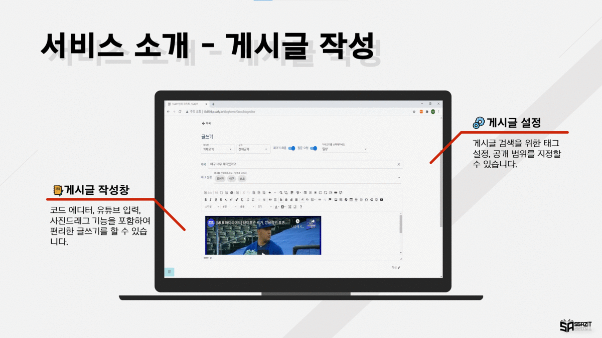

## Description

`SSAZIT`는 SSAFY 교육생을 위한 기술블로그입니다.

- __개인별 게시글 관리용 블로그__

  추억을 기록하는 공간, 학습한 내용을 정리하는 공간, 꿀팁을 공유하는 공간 등 다양한 내용으로  개인용 블로그를 채워보세요.

  블로그 내 게시판을 추가/삭제/수정/순서변경을 자유롭게 할 수 있습니다.

  코드 에디터, 유튜브 영상 첨부 등 다양한 글 쓰기 기능을 사용하여 편리하게 게시글을 작성할 수 있습니다.

- __게시글을 모아 책으로 만들기__ 

  관련된 게시글을 모아 책 게시물로 엮으면 나만의 교재, 나만의 앨범, 나만의 노트, 나만의 일기장을 쉽게 만들 수 있습니다.

  표지를 꾸며 개성 넘치는 책을 만들 수 있습니다.

  책 넘기기 애니메이션을 통해 실제 책처럼 생동감 있게 페이지를 넘길 수 있습니다.

- __사용자 간 커뮤니티__ 

  공유 범위를 지정하여 커뮤니티 게시판에서 게시글, 책을 공유해보세요!

  이달의 책에 선정되어 명예의 전당에 오르는 성취감을 느낄 수 있습니다.

  알고싶어요! 게시판을 통해 어려운 부분에 대해 도움을 요청하거나 코드리뷰를 받을 수 있습니다.

  도움이 되는 답변이 있다면 채택하면 댓글 중 최상단에 고정됩니다.


## Development Environment

-  
-  
-  
-  
-  
-  
-  
-  
-   
-  
-  
-  
-  


## Installation

#### For developer

로컬에서 코드를 원활하게 실행하기위해 두 개의 터미널을 사용해야합니다.

__백엔드 서버__

`STS`에서 실행해주세요.

__프론트 서버__

`./ssazitfe/` 디렉토리에서 진행해주세요.

1. 구동에 필요한 패키지 설치

   ```bash
   $ npm i
   ```

2. 서버 실행

   ```bash
   $ npm run serve
   ```

   

#### For user


~~아래의 버튼을 통해 서비스를 이용할 수 있습니다.~~

[](http://i3d104.p.ssafy.io/)


## Dependency

- 모든 코드는 Python 3과 JavaScript, Java 8로 작성되었습니다.
- 해당 프로젝트는 Vue, Spring Framework를 사용하여 구성되었습니다.


## Browser Support

|  |  |  |  |  |  |  |  |
| :----------------------------------: | :--------------------------: | :------------------------------------: | :------------------------------: | :-------------------------------: | :--------------------------------: | :-----------------------------------: | :-------------------------------: |
|                  ✔                   |              ❌               |                   ✔                    |                ✔                 |                 ✔                 |                 ✔                  |                   ✔                   |                 ✔                 |


## Demo




## Contributors

[](https://lab.ssafy.com/kei9641) | [](https://lab.ssafy.com/park940313)| [](https://lab.ssafy.com/bjh7013)| [](https://lab.ssafy.com/dngustls)| [](https://github.com/leeyongsu)


## Appenndix

| 파일 이름                                                    | 기술                                         |
| ------------------------------------------------------------ | -------------------------------------------- |
| [README](https://github.com/kei9641/Return-Movies/blob/master/README.md) | 프로젝트의 설명을 위한 텍스트 파일 (md 형식) |
| [demo](https://github.com/kei9641/SSAZIT/blob/master/appendix/demo.mp4) | 프로젝트 시연 영상 (mp4 형식)                |
| [intro](https://github.com/kei9641/SSAZIT/blob/master/appendix/intro.mp4) | 프로젝트 소개 영상 (mp4 형식)                |


#### How to contact me

- 추가적으로 궁금한 사항이나 연락을 원하시면 kei9641@naver.com으로 메일을 보내주세요. 읽는 즉시 답장드리겠습니다.
- 더 빠른 연락이 필요하시면 [오픈카톡](https://open.kakao.com/me/here0k)으로 연락주세요.

자세한 사항은 [프로필](#)을 확인해주세요.


© 2021. 김영주 all rights reserved.

